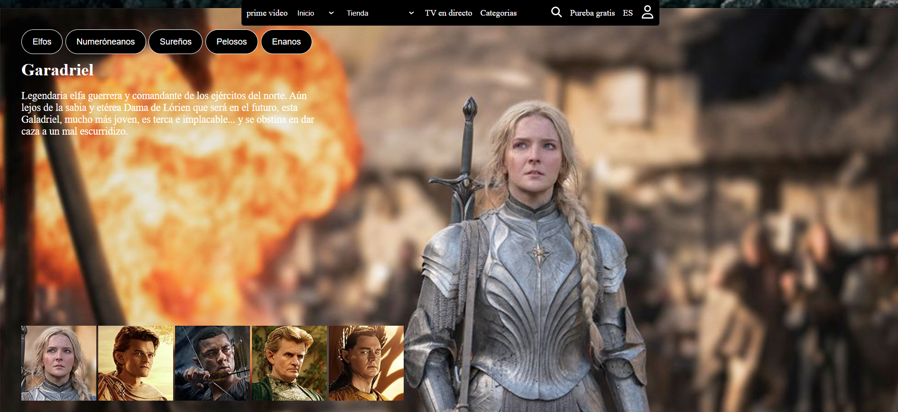

# README DE MI PÁGINITA DE LOS ANILLOS DEL PODER

La página consta de: 

- Un header.
- 5 Secciones.
- Un footer.
  
Cada apartado tiene un archivo css individual.

## Header

El header es una barra de navegación de color negra con el logo de prime video a la izq en color blando y una serie de enlaces entre los que se encuentran: 
1. INICIO 
   1. TODO.
   2. PELÍCULAS.
   3. SERIES.
   4. DEPORTES.
   
2. TIENDA
   1. TODO.
   2. ALQUILAR O COMPRAR.
   3. CANALES.
   
3. TV EN DIRECTO.
   
4. CATEGORÍAS.

5. ICONO DE BUSCADOR.

6. PRUEBA GRATIS.

7. IDIOMA.

8. ICONO PARA INICIAR SESIÓN O REGISTRARSE.

>[!NOTE]
El menú de navegación tiene un position:sticky para que el menú se quede fijo en la parte de arriba mientras hacemos scroll en la página.

## Sección 1

En la sección 1 se incluyen las nominaciones a premios, el logo de la serie, el número de temporadas, un pequeño resumen de cada temporada, unos enlaces con las categorías de la serie y 6 botones que son:

1. Para darte de alta en la prueba gratis de 30 días.
2. Trailer.
3. Mi lista.
4. Me gusta.
5. No me gusta.
6. Compartir.

## Sección 2

En la sección 2 se explica como se creó la serie y para ello se puso un slider con pequeños fragmentos de video explicando curiosidades de la grabación de cada capítulo.

## Sección 3

En la sección 3 se habla de los distintos personajes que hay en la serie. 

Si pinchamos en las fotos de los personajes nos cambiará la img de fondo de pantalla por una img del personaje seleccionado y nos dará un pequeño resumen de quien es.

## Sección 4 

En la sección 4 se habla de la edad en la que se desarrolla la seria, los reinos, las criaturas que habitan en él y los artefactos por los que luchan los personajes.

Según se pinche en un botón o en otro el fondo de pantalla irá cambiando y con él la descripción.

## Sección 5 

Aquí hay pequeños trailers de la serie.

## Footer

Aquí es el pie de página o footer en el que está el logo de prime video y un link a: 

1. Términos y avisos de privacidad.
2. Envíanos tus comentarios.
3. Ayuda.
4. Aviso sobre cookies.
5. Copyright.

>[!NOTE]
>Aquí dejo el link a la página oficial.  
>[Página oficial de Prime Video de Los Anillos del Poder](https://https://www.primevideo.com/)